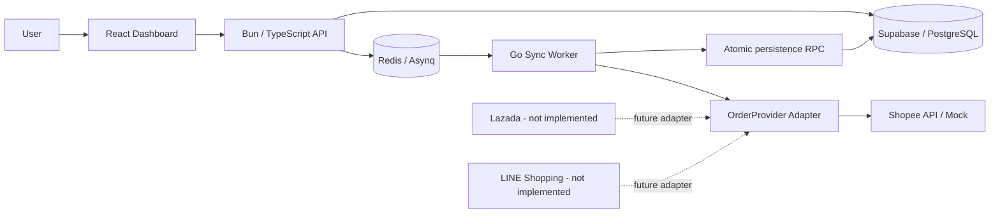

# Multi-Channel Order Management

A backend-focused order management system that normalizes marketplace orders into one internal model and processes synchronization asynchronously with Redis/Asynq.

The current engineering focus is on provider boundaries, retry safety, idempotency, HTTP reliability, testing, and database consistency.

> **Current status:** Shopee synchronization is the only implemented worker adapter. Lazada and LINE Shopping are UI/product placeholders, not working integrations. The original Bun backend source also needs to be restored because `mco-backend/app` was accidentally committed as an unresolved Git gitlink.

## Features

- React order-management dashboard
- Bun/TypeScript API layer (source recovery currently required; see [Known Repository Issue](#known-repository-issue))
- Go background order-sync worker
- Redis + Asynq background task processing
- Provider abstraction separating marketplace-specific payloads from core sync logic
- Normalized internal order and order-item models
- Deterministic local order identifiers for retry safety
- PostgreSQL uniqueness constraints for idempotent synchronization
- Atomic order + item persistence through a PostgreSQL RPC
- Context-aware HTTP requests with timeouts and non-2xx handling
- Structured worker logging
- Docker Compose local runtime
- Unit tests using fake repositories and `httptest.Server`

## Architecture



Detailed engineering decisions are documented in [`docs/architecture.md`](docs/architecture.md).

## Tech Stack

| Area | Technology |
| --- | --- |
| Frontend | React, TypeScript, Vite |
| API | Bun, TypeScript |
| Background processing | Go, Asynq |
| Queue | Redis |
| Database | Supabase / PostgreSQL |
| Provider and persistence HTTP | Go `net/http` |
| Local runtime | Docker Compose |

## Project Structure

```text
.
├── mco-backend/             # Bun/TypeScript API wrapper; nested app source needs recovery
├── mco-backgroundjob/       # Go marketplace synchronization worker
│   ├── domain.go            # normalized order model + deterministic IDs
│   ├── provider.go          # provider interface
│   ├── shopee_provider.go   # Shopee-specific HTTP adapter
│   ├── handler.go           # Asynq orchestration
│   └── repository.go        # atomic persistence boundary
├── mco-frontend/frontend/   # React dashboard
├── docs/
│   ├── architecture.md
│   └── sql/
└── docker-compose.yml
```

## Order Sync Flow

1. The API enqueues an `order:sync` task in Redis/Asynq.
2. The Go worker validates task identifiers and resolves the requested marketplace provider.
3. The provider adapter lists external order IDs and fetches order details.
4. Provider-specific payloads are normalized into internal `ExternalOrder`, `Order`, and `OrderItem` models.
5. Local order IDs are deterministically derived from `(shop_id, channel, external_order_id)`.
6. The repository sends one RPC request containing the order batch and items.
7. PostgreSQL upserts orders and items in one transaction.
8. Retrying the same logical sync targets the same rows rather than creating duplicates.

## Reliability Decisions

### Provider isolation

Shopee JSON models and HTTP endpoints live inside the Shopee adapter. The task handler depends only on the `OrderProvider` interface, which keeps future marketplace integrations from leaking into core synchronization code.

### Retry-safe identity

Asynq jobs can run more than once. The worker derives a stable UUID from `(shop_id, channel, external_order_id)` and relies on PostgreSQL unique constraints as the final guard.

### Atomic persistence

Apply these migrations in order:

```text
docs/sql/001_order_sync_idempotency.sql
docs/sql/002_atomic_order_sync.sql
```

`persist_synced_orders` runs the order and order-item upserts inside one PostgreSQL function call. If any statement fails, PostgreSQL aborts the function transaction, preventing a persisted order without its items.

The RPC is restricted to the Supabase `service_role`; the key must remain in the trusted worker environment.

### HTTP failure handling

Provider and persistence requests use injected `http.Client` instances with timeouts and `context.Context`. Non-2xx responses become contextual errors. Provider and repository behavior can both be tested with `httptest.Server`.

## Local Development

### Worker configuration

Copy the worker environment example:

```bash
cp mco-backgroundjob/.env.example mco-backgroundjob/.env
```

Set:

```text
REDIS_ADDR
SUPABASE_URL
SUPABASE_SERVICE_ROLE_KEY
SHOPEE_BASE_URL
```

`SHOPEE_BASE_URL` may point to a mock server during development. `SUPABASE_SERVICE_ROLE_KEY` must never be exposed to frontend code.

### Database migrations

Apply:

```text
docs/sql/001_order_sync_idempotency.sql
docs/sql/002_atomic_order_sync.sql
```

### Start local services

The repository includes a root `docker-compose.yml` for the frontend, backend wrapper, Redis, and Go worker. The backend container will not be reproducible from a clean clone until the nested backend source issue below is fixed.

## Testing

For the Go worker:

```bash
cd mco-backgroundjob
go test ./...
go vet ./...
```

Tests cover retry-safe identity, payload validation, Shopee response normalization, provider HTTP failures, repository RPC behavior, authentication headers, non-2xx persistence failures, and context cancellation without calling real marketplace or Supabase endpoints.

## Known Repository Issue

`mco-backend/app` is currently a Git tree entry with mode `160000` rather than normal source files. There is no usable `.gitmodules` mapping and the referenced nested commit is not available from another GitHub repository accessible to this account.

This likely happened because the backend directory had its own `.git` directory when it was added to the parent repository.

**Do not delete the gitlink until the original backend source has been recovered locally.** The safe recovery procedure is documented in [`docs/architecture.md`](docs/architecture.md#repository-issue-nested-backend-git-repository).

## Current Limitations

- Shopee is the only implemented worker adapter.
- Lazada and LINE Shopping are not implemented integrations yet.
- Some frontend bulk actions remain UI-only until the Bun backend source is restored and the status API can be implemented safely.
- Label generation is still incomplete/demo behavior.
- A real database integration test is still needed to execute the migration/RPC against PostgreSQL end-to-end.

## Future Improvements

1. Recover the original Bun backend source into the monorepo.
2. Implement and validate `NEW -> PACKED -> SHIPPED` on the backend.
3. Connect frontend bulk status actions to that API.
4. Add a database integration test for duplicate sync and transaction rollback.
5. Add real Lazada/LINE provider adapters only when there is a real integration target.

## Design Scope

The repository favors understandable engineering over unnecessary infrastructure. It uses a small number of explicit boundaries—provider, task handler, and repository—to support asynchronous processing, external API integration, idempotency, testability, and reliability without adding systems the current workload does not require.
