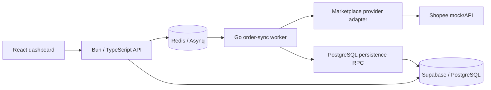

# Architecture

## Purpose

Multi-Channel Order Management collects orders from external commerce providers and exposes them through one internal order model. Synchronization runs asynchronously so slow or unreliable provider APIs do not block user-facing HTTP requests.

## Current high-level flow



Only the Shopee worker adapter is currently implemented. Lazada and LINE Shopping remain product/UI placeholders.

## Why asynchronous synchronization

Marketplace APIs can be slow, rate limited, temporarily unavailable, or require retries. The API queues an `order:sync` task in Redis/Asynq and returns control to the user-facing request path. The Go worker performs provider I/O and persistence separately.

## Provider abstraction

The worker depends on the `OrderProvider` interface instead of Shopee response structs:

```go
type OrderProvider interface {
    Channel() Channel
    ListOrderIDs(ctx context.Context, request ListOrdersRequest) ([]string, error)
    GetOrders(ctx context.Context, shopID string, externalOrderIDs []string) ([]ExternalOrder, error)
}
```

Provider-specific JSON stays inside the provider adapter. Core synchronization code only handles normalized domain models.

## Idempotency strategy

Asynq jobs may be retried, so processing must not create a new local order every time the same external order is seen.

Two protections are used:

1. Local order UUIDs are deterministic from `(shop_id, channel, external_order_id)`.
2. PostgreSQL unique indexes enforce logical identity for orders and order items.

The required constraints are in `docs/sql/001_order_sync_idempotency.sql`.

## Atomic persistence

`OrderSyncTaskHandler` depends on an `OrderRepository` interface rather than database details. The Supabase repository serializes the complete order/item batch and calls `persist_synced_orders` once through PostgREST RPC.

`docs/sql/002_atomic_order_sync.sql` defines the PostgreSQL function. A PostgreSQL function invocation runs in one transaction, so an error during item persistence aborts the order writes from that invocation as well.

The function performs conflict updates using the same logical identities used by the worker:

- order: `(shop_id, channel, external_order_id)`
- item: `(order_id, source_item_key)`

The RPC is revoked from public/browser roles and granted only to Supabase `service_role`. The worker therefore requires a server-side service-role key. That key must never be exposed in frontend code or browser-delivered environment variables.

The repository uses `net/http` directly for this call rather than the project's old `supabase-go v0.0.4` RPC wrapper because the older wrapper does not provide the error/status/context behavior needed here. The repository checks non-2xx responses and propagates request cancellation explicitly.

## HTTP reliability

Provider and persistence requests use injected `http.Client` instances with timeouts. Requests are created with the Asynq handler context so cancellation can propagate to external I/O.

Using injected clients and configurable endpoints allows behavior to be tested with `httptest.Server` rather than real external services.

## Order status workflow

The intended workflow is:

```text
NEW -> PACKED -> SHIPPED
```

Status changes should be validated by the backend rather than trusted from the browser. Implementation is blocked until the original Bun backend source is restored into the repository.

## Repository issue: nested backend Git repository

`mco-backend/app` is committed as a Git tree entry with mode `160000`, but this repository has no `.gitmodules` entry and the referenced commit is not available from another accessible GitHub repository.

That normally happens when `git add` is run on a directory that contains its own `.git` directory.

The safe recovery procedure on the machine that still has the backend source is:

```bash
cp -a mco-backend/app ../mco-backend-app-backup
rm -rf mco-backend/app/.git
git rm --cached mco-backend/app
git add mco-backend/app
git commit -m "fix(repo): restore backend source into monorepo"
```

Do not delete or replace the gitlink from GitHub without first recovering the original local source.

## Testing strategy

Worker tests focus on behavior that matters for reliability:

- retry-safe logical order identity
- deterministic order IDs
- invalid task payload handling
- provider response normalization
- provider non-2xx behavior
- one RPC request per persistence batch
- persistence authentication headers
- persistence non-2xx behavior
- context cancellation

A database integration test is still needed to apply the migrations to a disposable PostgreSQL/Supabase environment and prove duplicate handling plus rollback end-to-end.

## Trade-offs

### Redis + Asynq instead of Kafka

The workload currently needs a background job queue and retries, not a distributed event-streaming platform. Redis/Asynq is smaller and easier to operate for this workload.

### Modular monolith instead of microservices

The frontend, API, and worker are separate runtime processes, but the repository does not need many independently deployed domain services. Provider and repository interfaces create useful boundaries without adding network hops.

### Supabase/PostgREST retained

The project already uses Supabase. A small PostgreSQL RPC gives the worker an atomic transaction boundary without introducing another database client, connection pool, or database technology.
