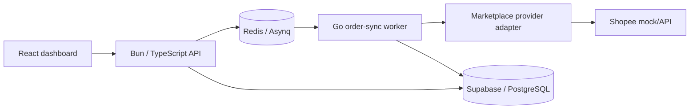

# Architecture

## Purpose

Multi-Channel Order Management collects orders from external commerce providers and exposes them through one internal order model. Synchronization runs asynchronously so slow or unreliable provider APIs do not block user-facing HTTP requests.

## Current high-level flow



Only the Shopee worker adapter is currently implemented. Lazada and LINE Shopping remain product/UI placeholders; they are not claimed as working integrations.

## Why asynchronous synchronization

Marketplace APIs can be slow, rate limited, temporarily unavailable, or require retries. The API therefore queues an `order:sync` task in Redis/Asynq and returns control to the user-facing request path. The Go worker performs provider I/O and persistence separately.

This keeps the HTTP API responsive and gives synchronization jobs an explicit retry boundary.

## Provider abstraction

The worker depends on the `OrderProvider` interface instead of Shopee response structs:

```go
type OrderProvider interface {
    Channel() Channel
    ListOrderIDs(ctx context.Context, request ListOrdersRequest) ([]string, error)
    GetOrders(ctx context.Context, shopID string, externalOrderIDs []string) ([]ExternalOrder, error)
}
```

Provider-specific JSON stays inside the provider adapter. Core synchronization code only handles `ExternalOrder`, `Order`, and `OrderItem`.

Adding a provider should require a new adapter rather than changes throughout task handling and persistence code.

## Normalized order model

The worker translates marketplace data into a provider-neutral internal model before writing to the database. Important identity fields are:

- `shop_id`
- `channel`
- `external_order_id`
- provider-derived `source_item_key` for order items

The internal model deliberately does not expose Shopee-specific response structs to the repository layer.

## Idempotency strategy

Asynq jobs may be retried, so processing must not create a new local order every time the same external order is seen.

Two protections are used:

1. Local order UUIDs are deterministic from `(shop_id, channel, external_order_id)`.
2. PostgreSQL unique indexes enforce logical identity for orders and order items.

The worker uses PostgREST upserts against those unique keys. Reprocessing the same external order therefore targets the same logical rows instead of appending duplicates.

The required SQL is in `docs/sql/001_order_sync_idempotency.sql`.

## HTTP reliability

Provider requests use an injected `http.Client` with a timeout. Requests are created with the Asynq handler context so cancellation can propagate to provider I/O.

The Shopee adapter rejects non-2xx responses and adds context to transport and JSON-decoding failures.

Using an injected client and configurable base URL also allows provider behavior to be tested with `httptest.Server` rather than real marketplace endpoints.

## Persistence boundary

`OrderSyncTaskHandler` depends on an `OrderRepository` interface instead of calling Supabase directly. This keeps task orchestration separate from database details and makes retry behavior unit-testable with an in-memory fake repository.

The current Supabase implementation performs order and order-item upserts as two PostgREST requests. This provides row-level idempotency but is **not an atomic transaction across both writes**.

### Transaction limitation

A failure between order upsert and item upsert can still leave a temporarily partial order. The preferred next step is one of:

1. a PostgreSQL function/RPC that persists an order and its items in one transaction, or
2. a direct PostgreSQL repository using a transaction.

This is intentionally documented as remaining technical debt instead of treating the current REST calls as transactional.

## Order status workflow

The frontend currently displays order statuses and exposes actions such as `Mark Packed` and `Mark Shipped`, but the Bun backend source is not recoverable from this repository because `mco-backend/app` is stored as an unresolved gitlink.

The intended internal workflow is:

```text
NEW -> PACKED -> SHIPPED
```

Status changes should be validated by the backend rather than trusted from the browser. Implementation is blocked until the original backend source is restored into the repository.

## Repository issue: nested backend Git repository

`mco-backend/app` is committed as a Git tree entry with mode `160000`, but this repository has no `.gitmodules` entry and the referenced commit is not available from another accessible GitHub repository.

That normally happens when `git add` is run on a directory that contains its own `.git` directory.

The safe recovery procedure on the machine that still has the backend source is:

```bash
# Back up the backend first.
cp -a mco-backend/app ../mco-backend-app-backup

# Remove only the nested repository metadata, not source files.
rm -rf mco-backend/app/.git

# Remove the gitlink from the parent index while keeping local files.
git rm --cached mco-backend/app

# Add the backend source as normal files.
git add mco-backend/app

git commit -m "fix(repo): restore backend source into monorepo"
```

Do not delete or replace the gitlink from GitHub without first recovering the original local source.

## Testing strategy

The worker tests focus on behavior that matters for reliability rather than raw coverage percentage:

- retry-safe logical order identity
- deterministic order IDs
- invalid task payload handling
- provider response normalization
- provider non-2xx behavior
- HTTP tests without calling a real provider

A future database integration test should apply the SQL migration to a temporary PostgreSQL/Supabase-compatible database and prove actual upsert behavior under duplicate tasks.

## Trade-offs

### Redis + Asynq instead of Kafka

The workload currently needs a background job queue and retries, not a distributed event-streaming platform. Redis/Asynq is smaller and easier to operate for this project.

### Modular monolith instead of microservices

The frontend, API, and worker are separate runtime processes, but the repository does not need many independently deployed domain services. Provider and repository interfaces create useful boundaries without adding network hops.

### Supabase/PostgREST retained

The project already uses Supabase, so the current design keeps it instead of replacing the database layer without a concrete requirement. A direct PostgreSQL repository is justified only if atomic order/item writes become a priority.
